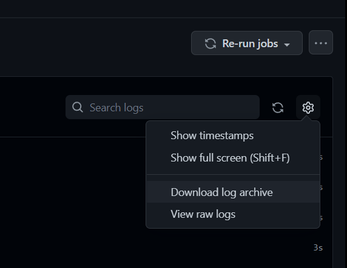

# Markdown link check log parser

[](https://github.com/edumserrano/markdown-link-check-log-parser/actions/workflows/build-test.yml)
[](https://github.com/edumserrano/markdown-link-check-log-parser/actions/workflows/test-action.yml)
[](https://codecov.io/gh/edumserrano/markdown-link-check-log-parser)
[](https://github.com/marketplace/actions/markdown-link-check-log-parser)
<!-- 
[](https://github.com/edumserrano/github-issue-forms-parser/actions/workflows/test-action.yml)
[](https://codecov.io/gh/edumserrano/github-issue-forms-parser)
-->

[](./LICENSE)
[](https://github.com/sponsors/edumserrano)
[](https://www.linkedin.com/in/eduardomserrano/)

A Docker container [GitHub action](https://docs.github.com/en/actions/learn-github-actions/finding-and-customizing-actions) that can be used to parse the log from a [GitHub Action - Markdown link check](https://github.com/gaurav-nelson/github-action-markdown-link-check) step.

As of writing this, the [GitHub Action - Markdown link check](https://github.com/gaurav-nelson/github-action-markdown-link-check) doesn't provide information from the Markdown link check as output of the action and there's even a long outstanding [open issue about it](https://github.com/gaurav-nelson/github-action-markdown-link-check/issues/9). This action is an alternative solution for that issue.

## Usage

This action is based on the log from the [Markdown Link Check action](https://github.com/gaurav-nelson/github-action-markdown-link-check) and since logs are only available when a worklfow is completed, we need to run this action on a separate workflow.

The recommended approach is to create a workflow that is triggered when the workflow that runs the `Markdown Link Check` action completes. You can do that as follows:

```yml
# This workflow runs the Markdown Link Check action
name: Markdown Link Check

on:
  push:
    branches: [ main ]

jobs:
  main:
    name: Run Markdown Link Check
    runs-on: ubuntu-latest
    steps:
    - uses: actions/checkout@v3
    - name: Markdown Link Check
      uses: gaurav-nelson/github-action-markdown-link-check@v1
      with:
        use-quiet-mode: no
```

```yml
# This workflow runs the Markdown Link Check log parser and is triggered when the above workflow completes
name: Markdown Link Check log parser

on:
  workflow_run:
    workflows: [
      "Markdown Link Check"
    ]
    types:
    - completed

defaults:
  run:
    shell: pwsh

jobs:
  main:
    name: Markdown Link Check log parser
    runs-on: ubuntu-latest
    steps:
    - uses: actions/checkout@v3
    - name: Run markdown link check log parser
      id: mlc-log-parser
      uses: edumserrano/markdown-link-check-log-parser@v1
      with:
        auth-token:  '${{ secrets.GITHUB_TOKEN }}'
        repo: '${{ github.repository }}'
        run-id: '${{ github.event.workflow_run.id }}'
        job-name: 'Run Markdown Link Check'
        step-name: 'Markdown Link Check'
        only-errors: 'false'
        output: 'step, json, md'
        json-filepath: './mlc-json-result.json'
        markdown-filepath: './mlc-md-result.md'
    - name: Dump output from previous step
      run: |
        $result = '${{ steps.mlc-log-parser.outputs.mlc-result }}' | ConvertFrom-Json
        Write-Output "Total files checked: $($result.TotalFilesChecked)"
        Write-Output "Total links chedked: $($result.TotalLinksChecked)"
        Write-Output "Has erros: $($result.HasErrors)"
        $resultAsJsonIndented = ConvertTo-Json -Depth 4 $result 
        Write-Output $resultAsJsonIndented # outputs the markdown link check result as an indented JSON string
    - name: Dump JSON file output
      run: |
        cat  ${{ github.workspace }}/mlc-json-result.json
    - name: Dump Markdown file output
      run: |
        cat  ${{ github.workspace }}/mlc-md-result.md
```

Since logs aren't available until the workflow completes, if you try to use this action on the same workflow that is runs the `Markdown Link Check` action you will get an error similar to:

```
An error occurred trying to execute the command to parse the log from a Markdown link check step.
Error:
- Failed to download workflow run logs. Got 404 NotFound from GET https://api.github.com/repos/edumserrano/markdown-link-check-log-parser/actions/runs/2605037118/logs.
```

## Action inputs

<!-- the &nbsp; is a trick to expand the width of the table column. You add as many &nbsp; as required to get the width you want. -->
| Name &nbsp; &nbsp; &nbsp; &nbsp; &nbsp; &nbsp; &nbsp; &nbsp; &nbsp; &nbsp; &nbsp; &nbsp; &nbsp; &nbsp; &nbsp; &nbsp; &nbsp; | Description                                                                                                                                               | Required | Default &nbsp; &nbsp; &nbsp; |
| ---------------------------------------------------------------------------------------------------------------------------------- | --------------------------------------------------------------------------------------------------------------------------------------------------------- | -------- | ---------------------------- |
| `auth-token`                                                                                                                       | GitHub token used to access workflow run logs.                                                                                                            | yes      | ---                          |
| `repo`                                                                                                                             | The repository for the workflow run in the format of {owner}/{repo}.                                                                                      | yes      | ---                          |
| `run-id`                                                                                                                           | The unique identifier of the workflow run that contains the markdown link check step.                                                                     | yes      | ---                          |
| `job-name`                                                                                                                         | The name of the job that contains the markdown link check step.                                                                                           | yes      | ---                          |
| `step-name`                                                                                                                        | The name of the markdown link check step.                                                                                                                 | yes      | ---                          |
| `only-errors`                                                                                                                      | Whether the output information contains file errors only or all files.                                                                                    | no       | true                         |
| `output`                                                                                                                           | How to output the markdown file check result. It must be one of or a comma separated list of the following values: step-json, step-md file-json, file-md. | no       | step-json                    |
| `json-filepath`                                                                                                                    | The filepath for the output JSON file, relative to the github workspace folder.                                                                           | no       | ---                          |
| `markdown-filepath`                                                                                                                | The filepath for the output markdown file, relative to the github workspace folder.                                                                       | no       | ---                          |

| Output option | Description                                                                                                                 |
| ------------- | --------------------------------------------------------------------------------------------------------------------------- |
| `step-json`   | Writes the log parser result as JSON to the step's outputs. Cannot be specified in combination with `step-md` option.       |
| `step-md`     | Writes the log parser result as markdown to the step's outputs. Cannot be specified in combination with `step-json` option. |
| `file-json`   | Writes the log parser result as JSON to a file.                                                                             |
| `file-md`     | Writes the log parser result as markdown to a file.                                                                         |

## Action outputs

| Name         | Description                                                    |
| ------------ | -------------------------------------------------------------- |
| `mlc-result` | The result from the Markdown Link Check action in JSON format. |

Note that the action also allows outputing the result from the Markdown Link Check action into a JSON file or into a Markdown files through the use of the appropriate action inputs.

## Tips

- You can use the markdown file or the markdown step output that is produced by this action and display it on the [job summary](https://github.blog/2022-05-09-supercharging-github-actions-with-job-summaries/), or on a Pull Request, or on an Issue.
- If you want a custom markdown file instead of the one that is produced by default you can process the JSON output from the `Markdown Link Check log parser` step or the JSON file produced and create a markdown to your liking.
- You can upload the files produced by this action as [build artifacts](https://docs.github.com/en/actions/using-workflows/storing-workflow-data-as-artifacts) for later retrieval.
- The `json-filepath` and `markdown-filepath` inputs from this action are relative to the github workspace folder. This means that if you specify a path such as `./output.json` then the file will be created at `${{ github.workspace }}/output.json`. Note that the github workspace is the default working directory on the runner for steps, and the default location of your repository when using the checkout action. For example, /home/runner/work/my-repo-name/my-repo-name.

## Examples of the JSON file produced

- [JSON output with errors](/.github/workflows/markdown-link-check-files/expected-file-outputs/with-errors/result-without-capture-errors-only.json)
- [JSON output without errors](/.github/workflows/markdown-link-check-files/expected-file-outputs/without-errors/result.json)

## Examples of the markdown file produced

- [Markdown output with errors](/.github/workflows/markdown-link-check-files/expected-file-outputs/with-errors/result-without-capture-errors-only.md)
- [Markdown output without errors](/.github/workflows/markdown-link-check-files/expected-file-outputs/without-errors/result.md)

## Notes regarding the `Markdown Link Check` log

The output from this action depends on the log generated by the [Markdown Link Check action](https://github.com/gaurav-nelson/github-action-markdown-link-check). And as such note that:

- The default value for the `output` option for this action is `step` which outputs the result of parsing the `Markdown Link Check` action as an output of the step that runs the `Markdown Link Check log parser` action. However, you should note that there is a maximum size for the output of a step. As of writing this the [maximum size for the output of a step is 1 MB](https://docs.github.com/en/actions/creating-actions/metadata-syntax-for-github-actions#outputs-for-docker-container-and-javascript-actions).
- If the output from this action exceeds the limit of 1 MB for the step output you can still set the `output` option to `json` or `md` and the output will be written to files. You can then upload these files as [build artifacts](https://docs.github.com/en/actions/using-workflows/storing-workflow-data-as-artifacts) or add their contents to [job summaries](https://github.blog/2022-05-09-supercharging-github-actions-with-job-summaries/), Pull Requests or Issues.
- If you set the `Markdown Link Check` option `use-quiet-mode` to `yes` then the output from this action will only have information regarding errors. The statistics produced will only be about errors and not the full links in your markdown files.
- If the output from the  `Markdown Link Check` action changes then this action might not work as expected. This action was tested against version [`1.0.13`](https://github.com/gaurav-nelson/github-action-markdown-link-check/releases). You should be able to trust that as long as the build status badges on the top of this `README` are green then this action is working as expected.

## Example usages of this action in GitHub workflows

- [This workflow](https://github.com/edumserrano/markdown-link-check-log-parser/blob/main/.github/workflows/test-action.yml) is used to test that the action works as expected.
<!-- - [This workflow](https://github.com/edumserrano/dot-net-sdk-extensions/blob/33303189c564989fd40fcb1fa5086ca443f7bd92/.github/workflows/nuget-release.yml#L69-L73) shows the usage of the action as part of the release flow of a NuGet package. -->

## Troubleshooting: I can't figure out the right job name and step name to use

You can download the logs from your workflow by:

1) Go into the job of of the workflow where you are running the [Markdown Link Check](https://github.com/gaurav-nelson/github-action-markdown-link-check) action.
2) Select the cog wheel that shows on the top right and you will see an option to download the logs as shown by the image below.



You can then extract the log zip file and you can find which file contains the log for the Markdown Link Check step.
The job name will be equal to the folder name where the Markdown Link Check step log is.
The step name will be equal to the name of the log file for the Markdown Link Check step but without the prefix for the 'number_'.

**Example:**

If the log file for the Markdown Link Check step is named `5_Markdown link check.txt` and this file is inside a folder named `Check links` then the action inputs should be:

- job-name: 'Check links'
- step-name: 'Markdown link check'

## Dev notes

For notes aimed at developers working on this repo or just trying to understand it go [here](/docs/dev-notes/README.md). It will show you how to build and run the solution among other things.
